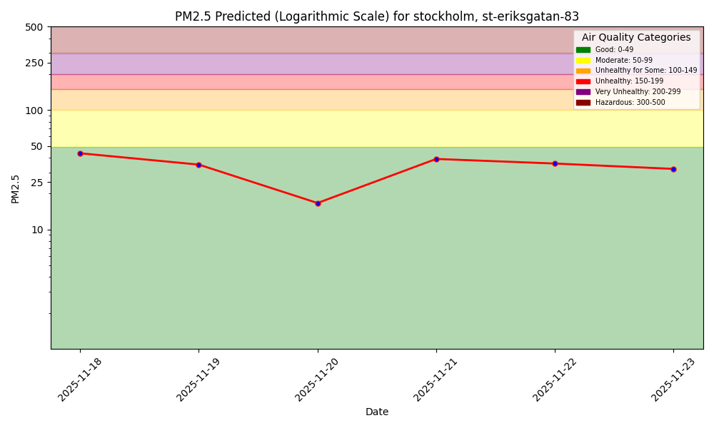
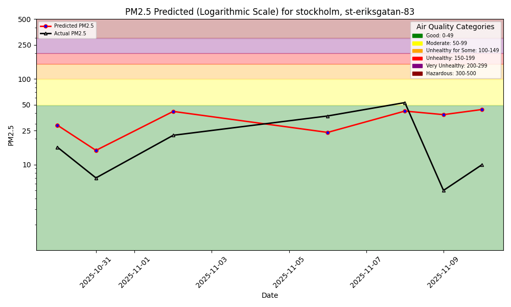

# Air Quality Dashboard - Stockholm St. Eriksgatan 83

**Sensor Location:** Stockholm, Sweden - St. Eriksgatan 83
**Station ID:** @10523
**Last Updated:** Auto-updated daily at 08:00 UTC

---

## 7-Day PM2.5 Forecast

This chart shows predicted PM2.5 (fine particulate matter) levels for the next 7-10 days.

---

## Model Performance Monitoring

**1-Day Hindcast: Predictions vs Actual Measurements**

This chart compares our model's predictions (made 1 day in advance) against actual measured air quality values.

---

## About PM2.5

PM2.5 refers to fine particulate matter with a diameter of less than 2.5 micrometers. These particles can penetrate deep into the lungs and even enter the bloodstream, posing health risks.

**Health Guidelines (μg/m³):**
- **0-12:** Good
- **12-35:** Moderate
- **35-55:** Unhealthy for sensitive groups
- **55+:** Unhealthy

---

## Technical Details

- **Model:** XGBoost Regression
- **Features:** Temperature, precipitation, wind speed, wind direction
- **Training Data:** Historical air quality + weather data
- **Update Frequency:** Daily predictions at 08:00 UTC
- **Feature Store:** [Hopsworks](https://www.hopsworks.ai/)

---

## LLM Integration

There is also a Python program to interact with the air quality ML system using natural language (text or voice), powered by a [function-calling LLM](https://www.hopsworks.ai/dictionary/function-calling-with-llms).

---

**Built for ID2223 Scalable Machine Learning @ KTH**
